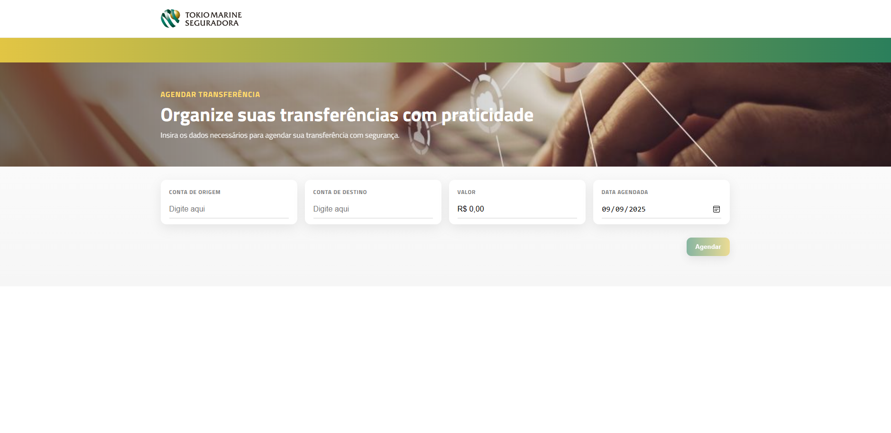
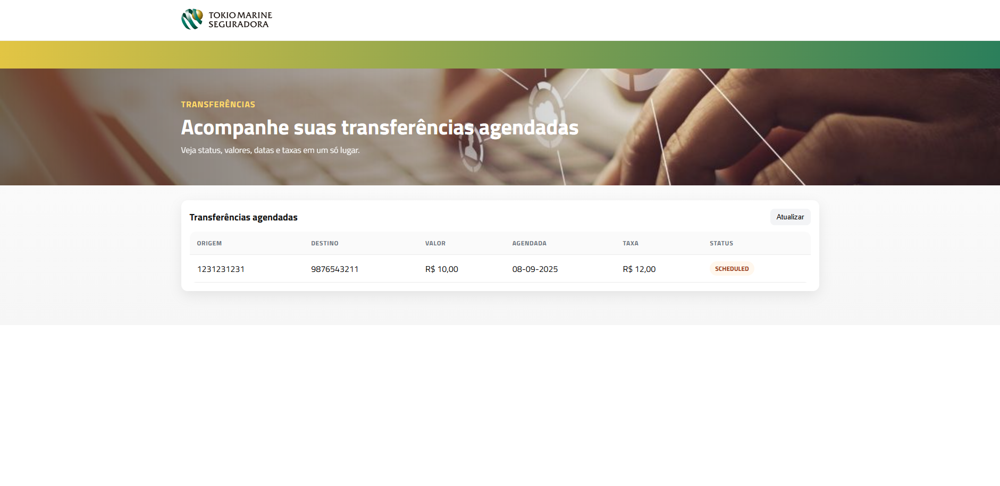

# Tokio Transfer API

- Serviço de agendamento de transferências com cálculo de taxa por faixa de dias **D** (diferença entre **hoje** e a `transferDate`, fuso `America/Sao_Paulo`).

## Arquitetura
O projeto foi estruturado em **camadas (MVC)**, com separação entre:
- **Controller** → exposição dos endpoints REST.
- **Service** → regras de negócio, cálculos e validações.
- **Repository** → persistência e integração com o banco de dados.
- **Model/DTO** → entidades de domínio e objetos de transporte.

Essa escolha facilita manutenção, testes unitários, reuso de código e adesão a boas práticas de mercado (Clean Architecture / Separation of Concerns).

## Tecnologias
- Java 11 (Eclipse Adoptium)
- Spring Boot (Web, Validation, Data JPA)
- VUE

## Regras de negócio (resumo)
- `D = daysBetween(hojeBR, transferDate)`
- Se `transferDate < hojeBR` → **422** “A data da transferência deve ser hoje ou futura.”
- Se `D < 0` ou `D > 50` → **422** “Sem taxa aplicável para a data informada.”
- Arredondamento de taxa: **2 casas**, `HALF_UP`.

> **Observação:** a data de agendamento (`scheduledDate`) é definida pelo domínio como **hoje** (fuso SP) na criação e não é informada pelo cliente.

### Tabela de taxa
- `D = 0` → **R$ 3,00 + 2,50%**
- `1 ≤ D ≤ 10` → **R$ 12,00**
- `11 ≤ D ≤ 20` → **8,2%**
- `21 ≤ D ≤ 30` → **6,9%**
- `31 ≤ D ≤ 40` → **4,7%**
- `41 ≤ D ≤ 50` → **1,7%**

--------------
# Back-end

### Instalar dependências

- No Windows: powershell
```
.\mvnw.cmd clean install
.\mvnw.cmd spring-boot:run
```

- Mac/Linux: bash
```
./mvnw clean install
./mvnw spring-boot:run
```
- IDE
1. abra o arquivo -> TokioMarineApplication
2. RUN ou Shift+F10 (intellij) 

## Como acessar o console (H2)

### Suba a aplicação:

```
mvn spring-boot:run
```

### Abra no navegador:

http://localhost:8080/h2-console


### Preencha os campos:

**JDBC URL**: ```jdbc:jdbc:h2:mem:tokio```

***User Name***: ```tokio```

***Password***: ```(vazio)```

### Consulta rápida para verificar dados:

SELECT * FROM transfers;

## Como usar o Swagger

### Abra no navegador
http://localhost:8080/swagger-ui/index.html

## Endpoints

### POST `/transfers`
Cria uma transferência.

**Request body**
```json
{
  "sourceAccount": "1234567890",
  "destinationAccount": "0987654321",
  "amount": 1200.50,
  "transferDate": "2025-09-10"
}
```

### GET `/transfers`
Veja todas as transferências adicionadas.

--------------
# Front-end
1. cd TOKIO-TRANSFER-WEB
2. npm install
3. npm run dev

### Abra no navegador
http://localhost:5173/

- Nessa primeira pagina podemos ter acesso aos dois serviços:
Agendar Transferência e Transferências agendadas. 


- Em Transferências agendadas podemos agendar o serviço.
- No logotipo podemos voltar a página home.


- Na página transferências agendadas podemos ver todos os agendamentos.
